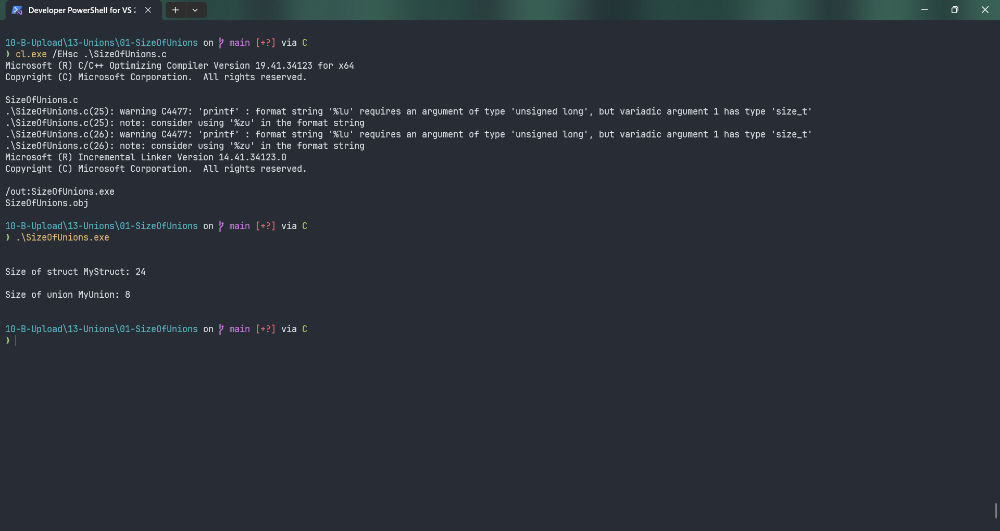

# SizeOfUnions

Submitted by Yash Pravin Pawar (RTR2024-023)

## Output Screenshots


## Code
### [SizeOfUnions.c](./01-Code/SizeOfUnions.c)
```c
#include <stdio.h>

struct MyStruct
{
    int i;
    float f;
    double d;
    char c;
};

union MyUnion
{
    int i;
    float f;
    double d;
    char c;
};

int main(void)
{
    struct MyStruct ypp_s;
    union MyUnion ypp_u;

    printf("\n\n");
    printf("Size of struct MyStruct: %lu\n\n", sizeof(ypp_s));
    printf("Size of union MyUnion: %lu\n\n", sizeof(ypp_u));

    return (0);
}

```
