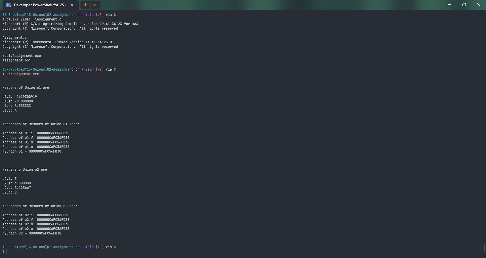

# Assignment

Submitted by Yash Pravin Pawar (RTR2024-023)

## Output Screenshots


## Code
### [Assignment.c](./01-Code/Assignment.c)
```c
#include <stdio.h>

union MyUnion
{
    int i;
    float f;
    double d;
    char c;
};

int main(void)
{
    union MyUnion u1, u2;

    printf("\n\n");
    printf("Members of Union u1 Are:\n\n");

    u1.i = 6;
    u1.f = 1.2f;
    u1.d = 8.333333;
    u1.c = 'A';

    printf("u1.i: %d\n", u1.i);
    printf("u1.f: %f\n", u1.f);
    printf("u1.d: %f\n", u1.d);
    printf("u1.c: %c\n", u1.c);

    printf("\n\n");
    printf("Addresses of Members of Union u1 aare:\n\n");
    printf("Address of u1.i: %p\n", &u1.i);
    printf("Address of u1.f: %p\n", &u1.f);
    printf("Address of u1.d: %p\n", &u1.d);
    printf("Address of u1.c: %p\n", &u1.c);

    printf("MyUnion u1 = %p\n\n", &u1);

    printf("\n\n");
    printf("Members o Union u2 Are:\n\n");

    u2.i = 3;
    printf("u2.i: %d\n", u2.i);

    u2.f = 4.5f;
    printf("u2.f: %f\n", u2.f);

    u2.d = 5.123467;
    printf("u2.d: %f\n", u2.d);

    u2.c = 'B';
    printf("u2.c: %c\n", u2.c);

    printf("\n\n");

    printf("Addresses of Members of Union u2 are:\n\n");
    printf("Address of u2.i: %p\n", &u2.i);
    printf("Address of u2.f: %p\n", &u2.f);
    printf("Address of u2.d: %p\n", &u2.d);
    printf("Address of u2.c: %p\n", &u2.c);

    printf("MyUnion u2 = %p\n\n", &u2);

    return (0);
}

```
