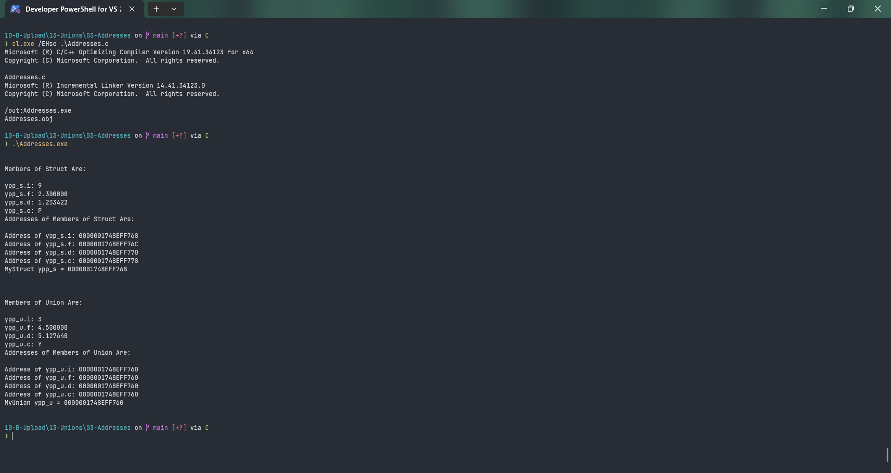

# Addresses

Submitted by Yash Pravin Pawar (RTR2024-023)

## Output Screenshots


## Code
### [Addresses.c](./01-Code/Addresses.c)
```c
#include <stdio.h>

struct MyStruct
{
    int i;
    float f;
    double d;
    char c;
};

union MyUnion
{
    int i;
    float f;
    double d;
    char c;
};

int main(void)
{
    struct MyStruct ypp_s;
    union MyUnion ypp_u;

    printf("\n\n");
    printf("Members of Struct Are:\n\n");

    ypp_s.i = 9;
    ypp_s.f = 2.3f;
    ypp_s.d = 1.233422;
    ypp_s.c = 'P';

    printf("ypp_s.i: %d\n", ypp_s.i);
    printf("ypp_s.f: %f\n", ypp_s.f);
    printf("ypp_s.d: %f\n", ypp_s.d);
    printf("ypp_s.c: %c\n", ypp_s.c);

    printf("Addresses of Members of Struct Are: \n\n");
    printf("Address of ypp_s.i: %p\n", &ypp_s.i);
    printf("Address of ypp_s.f: %p\n", &ypp_s.f);
    printf("Address of ypp_s.d: %p\n", &ypp_s.d);
    printf("Address of ypp_s.c: %p\n", &ypp_s.c);

    printf("MyStruct ypp_s = %p\n\n", &ypp_s);

    printf("\n\n");
    printf("Members of Union Are:\n\n");

    ypp_u.i = 3;
    printf("ypp_u.i: %d\n", ypp_u.i);

    ypp_u.f = 4.5f;
    printf("ypp_u.f: %f\n", ypp_u.f);

    ypp_u.d = 5.12764;
    printf("ypp_u.d: %f\n", ypp_u.d);

    ypp_u.c = 'Y';
    printf("ypp_u.c: %c\n", ypp_u.c);

    printf("Addresses of Members of Union Are: \n\n");
    printf("Address of ypp_u.i: %p\n", &ypp_u.i);
    printf("Address of ypp_u.f: %p\n", &ypp_u.f);
    printf("Address of ypp_u.d: %p\n", &ypp_u.d);
    printf("Address of ypp_u.c: %p\n", &ypp_u.c);

    printf("MyUnion ypp_u = %p\n\n", &ypp_u);

    return (0);
}

```
