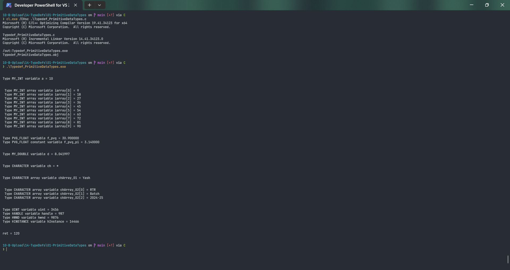

# Typedef_PrimitiveDataTypes

Submitted by Yash Pravin Pawar (RTR2024-023)

## Output Screenshots


## Code
### [Typedef_PrimitiveDataTypes.c](./01-Code/Typedef_PrimitiveDataTypes.c)
```c
#include <stdio.h>

typedef int MY_INT;

int main(void)
{
    MY_INT Add(MY_INT, MY_INT);

    typedef int MY_INT;
    typedef float PVG_FLOAT;
    typedef char CHARACTER;
    typedef double MY_DOUBLE;

    // like in win32 sdk
    typedef unsigned int UINT;
    typedef UINT HANDLE;
    typedef HANDLE HWND;
    typedef HANDLE HINSTANCE;

    MY_INT ypp_a = 10, i;
    MY_INT ypp_iArray[] = { 9, 18, 27, 36, 45, 54, 63, 72, 81, 90 };

    PVG_FLOAT ypp_f_pvg = 30.9f;
    const PVG_FLOAT ypp_f_pvg_pi = 3.14f;

    CHARACTER ypp_ch = '*';
    CHARACTER ypp_chArray_01[] = "Yash";
    CHARACTER ypp_chArray_02[][10] = { "RTR", "Batch", "2024-25" };

    MY_DOUBLE ypp_d = 8.041997;

    UINT ypp_uint = 3456;
    HANDLE ypp_handle = 987;
    HWND ypp_hwnd = 9876;
    HINSTANCE ypp_hInstance = 14466;

    // code
    printf("\n\n");
    printf("Type MY_INT variable a = %d\n", ypp_a);

    printf("\n\n");

    for (i = 0; i < (sizeof(ypp_iArray) / sizeof(int)); i++)
    {
        printf(" Type MY_INT array variable iarray[%d] = %d\n", i, ypp_iArray[i]);
    }

    printf("\n\n");
    printf("Type PVG_FLOAT variable f_pvg = %f\n", ypp_f_pvg);
    printf("Type PVG_FLOAT constant variable f_pvg_pi = %f\n", ypp_f_pvg_pi);

    printf("\n\n");
    printf("Type MY_DOUBLE variable d = %f\n", ypp_d);

    printf("\n\n");
    printf("Type CHARACTER variable ch = %c\n", ypp_ch);

    printf("\n\n");
    printf("Type CHARACTER array variable chArray_01 = %s\n", ypp_chArray_01);

    printf("\n\n");
    for (i = 0; i < (sizeof(ypp_chArray_02) / sizeof(ypp_chArray_02[0])); i++)
    {
        printf(" Type CHARACTER array variable chArray_02[%d] = %s\n", i, ypp_chArray_02[i]);
    }

    printf("\n\n");

    printf("Type UINT variable uint = %u\n", ypp_uint);
    printf("Type HANDLE variable handle = %u\n", ypp_handle);
    printf("Type HWND variable hwnd = %u\n", ypp_hwnd);
    printf("Type HINSTANCE variable hInstance = %u\n", ypp_hInstance);
    printf("\n\n");

    MY_INT x = 90;
    MY_INT y = 30;
    MY_INT ret;

    ret = Add(x, y);
    printf("ret = %d\n\n", ret);

    return (0);
}

MY_INT Add(MY_INT a, MY_INT b)
{
    MY_INT c;
    c = a + b;
    return (c);
}

```
