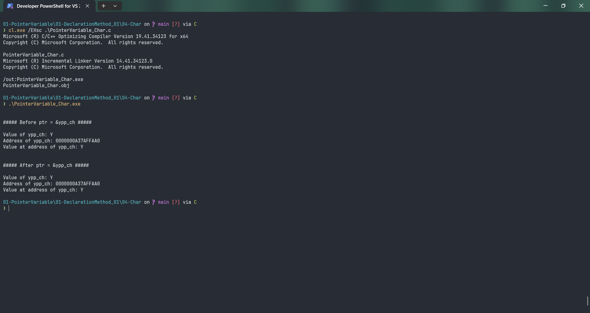

# PointerVariable_Char

Submitted by Yash Pravin Pawar (RTR2024-023)

## Output Screenshots


## Code
### [PointerVariable_Char.c](./01-Code/PointerVariable_Char.c)
```c
#include <stdio.h>

int main(void)
{
    char ypp_ch;
    char *ptr = NULL;

    ypp_ch = 'Y';

    printf("\n\n");
    printf("##### Before ptr = &ypp_ch #####\n\n");
    printf("Value of ypp_ch: %c\n", ypp_ch);
    printf("Address of ypp_ch: %p\n", &ypp_ch);
    printf("Value at address of ypp_ch: %c\n", *(&ypp_ch));

    ptr = &ypp_ch;

    printf("\n\n");
    printf("##### After ptr = &ypp_ch #####\n\n");
    printf("Value of ypp_ch: %c\n", ypp_ch);
    printf("Address of ypp_ch: %p\n", ptr);
    printf("Value at address of ypp_ch: %c\n", *ptr);

    return (0);
}
```
