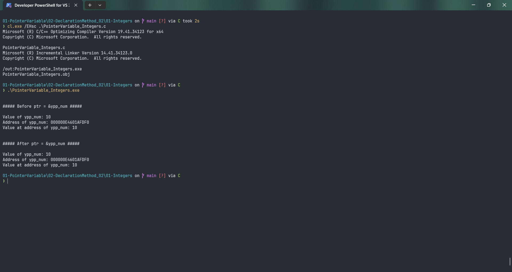

# PointerVariable_Integers

Submitted by Yash Pravin Pawar (RTR2024-023)

## Output Screenshots


## Code
### [PointerVariable_Integers.c](./01-Code/PointerVariable_Integers.c)
```c
#include <stdio.h>

int main(void)
{
    int ypp_num;
    int* ptr = NULL;

    ypp_num = 10;

    printf("\n\n");
    printf("##### Before ptr = &ypp_num #####\n\n");
    printf("Value of ypp_num: %d\n", ypp_num);
    printf("Address of ypp_num: %p\n", &ypp_num);
    printf("Value at address of ypp_num: %d\n", *(&ypp_num));

    ptr = &ypp_num;

    printf("\n\n");
    printf("##### After ptr = &ypp_num #####\n\n");
    printf("Value of ypp_num: %d\n", ypp_num);
    printf("Address of ypp_num: %p\n", ptr);
    printf("Value at address of ypp_num: %d\n", *ptr);

    return (0);
}
```
