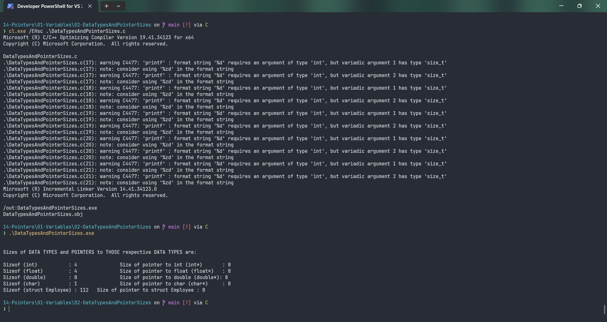

# DataTypesAndPointerSizes

Submitted by Yash Pravin Pawar (RTR2024-023)

## Output Screenshots


## Code
### [DataTypesAndPointerSizes.c](./01-Code/DataTypesAndPointerSizes.c)
```c
#include <stdio.h>

struct Employee
{
    char name[100];
    int age;
    float salary;
    char sex;
    char marital_status;
};

int main(void)
{
    printf("\n\n");

    printf("Sizes of DATA TYPES and POINTERS to THOSE respective DATA TYPES are: \n\n");
    printf("Sizeof (int)           : %d \t\t Size of pointer to int (int*)       : %d\n", sizeof(int), sizeof(int*));
    printf("Sizeof (float)         : %d \t\t Size of pointer to float (float*)   : %d\n", sizeof(float), sizeof(float*));
    printf("Sizeof (double)        : %d \t\t Size of pointer to double (double*): %d\n", sizeof(double), sizeof(double*));
    printf("Sizeof (char)          : %d \t\t Size of pointer to char (char*)     : %d\n", sizeof(char), sizeof(char*));
    printf("Sizeof (struct Employee) : %d \t Size of pointer to struct Employee : %d\n", sizeof(struct Employee), sizeof(struct Employee*));

    return (0);
}


```
