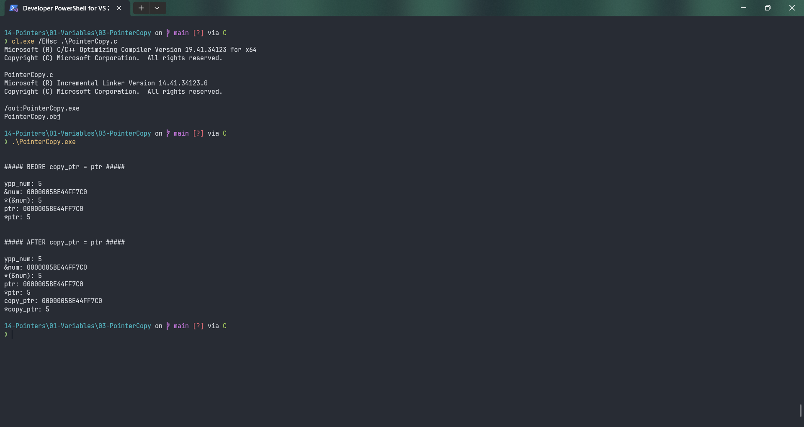

# PointerCopy

Submitted by Yash Pravin Pawar (RTR2024-023)

## Output Screenshots


## Code
### [PointerCopy.c](./01-Code/PointerCopy.c)
```c
#include <stdio.h>

int main(void)
{
    int ypp_num;
    int *ptr = NULL;
    int *copy_ptr = NULL;

    ypp_num = 5;
    ptr = &ypp_num;

    printf("\n\n");
    printf("##### BEORE copy_ptr = ptr #####\n\n");
    printf("ypp_num: %d\n", ypp_num);
    printf("&num: %p\n", &ypp_num);
    printf("*(&num): %d\n", *(&ypp_num));
    printf("ptr: %p\n", ptr);
    printf("*ptr: %d\n", *ptr);

    copy_ptr   = ptr;
    printf("\n\n");
    printf("##### AFTER copy_ptr = ptr #####\n\n");
    printf("ypp_num: %d\n", ypp_num);
    printf("&num: %p\n", &ypp_num);
    printf("*(&num): %d\n", *(&ypp_num));
    printf("ptr: %p\n", ptr);
    printf("*ptr: %d\n", *ptr);
    printf("copy_ptr: %p\n", copy_ptr);
    printf("*copy_ptr: %d\n", *copy_ptr);

    return (0);
}

```
