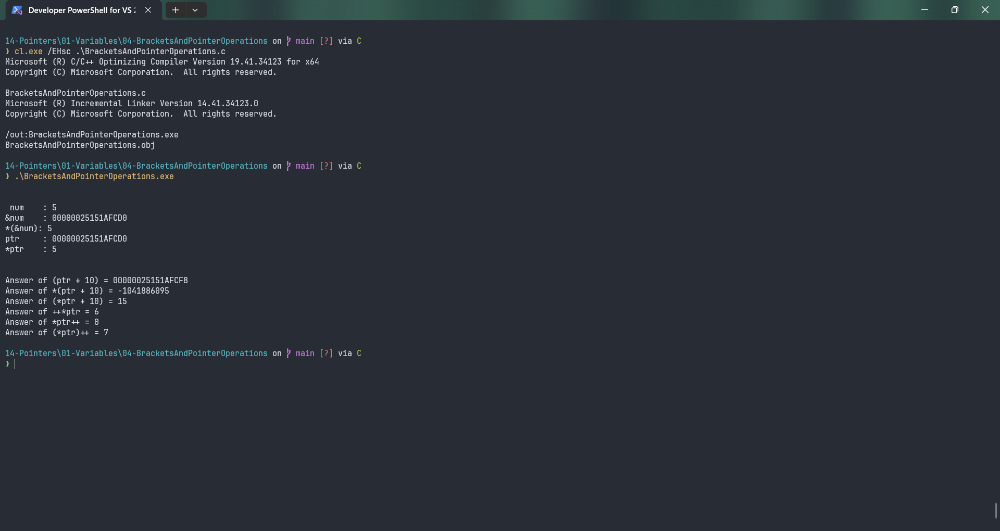

# BracketsAndPointerOperations

Submitted by Yash Pravin Pawar (RTR2024-023)

## Output Screenshots


## Code
### [BracketsAndPointerOperations.c](./01-Code/BracketsAndPointerOperations.c)
```c
#include <stdio.h>

int main(void)
{
    int ypp_num;
    int *ptr = NULL;
    int ans;

    ypp_num = 5;
    ptr = &ypp_num;

    printf("\n\n");
    printf(" num \t: %d\n", ypp_num);
    printf("&num \t: %p\n", &ypp_num);
    printf("*(&num): %d\n", *(&ypp_num));
    printf("ptr \t: %p\n", ptr);
    printf("*ptr \t: %d\n", *ptr);

    printf("\n\n");

    printf("Answer of (ptr + 10) = %p\n", (ptr + 10));

    printf("Answer of *(ptr + 10) = %d\n", *(ptr + 10));

    printf("Answer of (*ptr + 10) = %d\n", (*ptr + 10));

    ++*ptr;

    printf("Answer of ++*ptr = %d\n", *ptr);

    *ptr++;
    printf("Answer of *ptr++ = %d\n", *ptr);

    ptr = &ypp_num;
    (*ptr)++;
    printf("Answer of (*ptr)++ = %d\n", *ptr);

    return (0);
}

```
