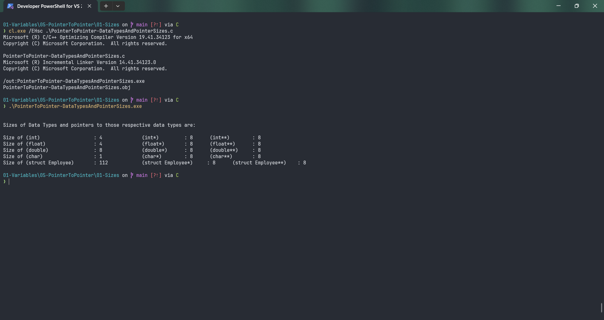

# PointerToPointer-DataTypesAndPointerSizes

Submitted by Yash Pravin Pawar (RTR2024-023)

## Output Screenshots


## Code
### [PointerToPointer-DataTypesAndPointerSizes.c](./01-Code/PointerToPointer-DataTypesAndPointerSizes.c)
```c
#include<stdio.h>

struct Employee
{
    char name[100];
    int age;
    float salary;
    char sex;
    char marital_status;
};

int main(void)
{
    // code
    printf("\n\n");
    printf("Sizes of Data Types and pointers to those respective data types are: \n\n");
    printf("Size of (int) \t\t\t: %zd\t\t (int*) \t: %zd \t (int**) \t: %zd\n", sizeof(int), sizeof(int*), sizeof(int**));   
    printf("Size of (float) \t\t: %zd\t\t (float*) \t: %zd \t (float**) \t: %zd\n", sizeof(float), sizeof(float*), sizeof(float**));   
    printf("Size of (double) \t\t: %zd\t\t (double*) \t: %zd \t (double**) \t: %zd\n", sizeof(double), sizeof(double*), sizeof(double**));   
    printf("Size of (char) \t\t\t: %zd\t\t (char*) \t: %zd \t (char**) \t: %zd\n", sizeof(char), sizeof(char*), sizeof(char**));   
    printf("Size of (struct Employee) \t: %zd\t\t (struct Employee*) \t: %zd \t (struct Employee**) \t: %zd\n", sizeof(struct Employee), sizeof(struct Employee*), sizeof(struct Employee**));

    return (0);   
}

```
