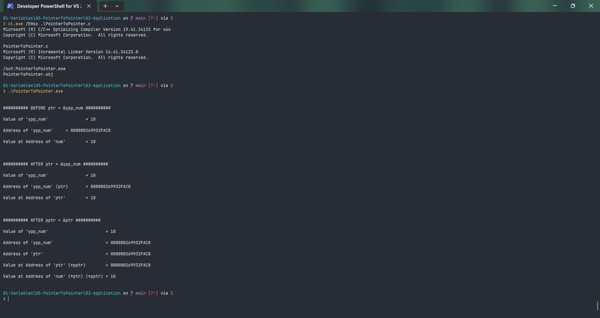

# PointerToPointer

Submitted by Yash Pravin Pawar (RTR2024-023)

## Output Screenshots


## Code
### [PointerToPointer.c](./01-Code/PointerToPointer.c)
```c
#include <stdio.h>

int main(void)
{
    // variable declarations
    int ypp_num;
    int *ptr_ypp = NULL;
    int **pptr_ypp = NULL;

    // code
    ypp_num = 10;

    printf("\n\n");

    printf("########## BEFORE ptr = &ypp_num ########## \n\n");
    printf("Value of 'ypp_num' \t\t = %d\n\n", ypp_num);
    printf("Address of 'ypp_num' \t = %p\n\n", &ypp_num);
    printf("Value at Address of 'num' \t = %d\n\n", *(&ypp_num));

    ptr_ypp = &ypp_num;

    printf("\n\n");

    printf("########## AFTER ptr = &ypp_num ########## \n\n");

    printf("Value of 'ypp_num' \t\t = %d\n\n", ypp_num);
    printf("Address of 'ypp_num' (ptr) \t = %p\n\n", ptr_ypp);
    printf("Value at Address of 'ptr' \t = %d\n\n", *ptr_ypp);

    pptr_ypp = &ptr_ypp;

    printf("\n\n");

    printf("########## AFTER pptr = &ptr ########## \n\n");

    printf("Value of 'ypp_num'                       = %d\n\n", ypp_num);
    printf("Address of 'ypp_num'                     = %p\n\n", ptr_ypp);
    printf("Address of 'ptr'                         = %p\n\n", pptr_ypp);
    printf("Value at Address of 'ptr' (*pptr)        = %p\n\n", *pptr_ypp);
    printf("Value at Address of 'num' (*ptr) (*pptr) = %d\n\n", **pptr_ypp);

}

```
