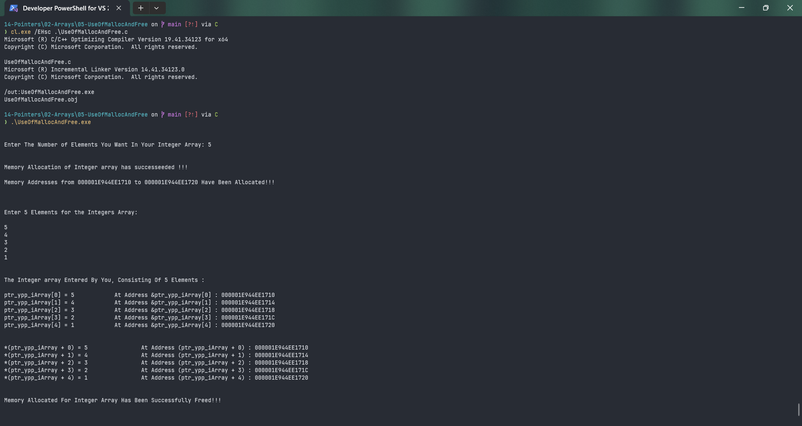

# UseOfMallocAndFree

Submitted by Yash Pravin Pawar (RTR2024-023)

## Output Screenshots


## Code
### [UseOfMallocAndFree.c](./01-Code/UseOfMallocAndFree.c)
```c
#include <stdio.h>
#include <stdlib.h>

int main(void)
{
    int *ptr_ypp_iArray = NULL;
    unsigned int intYppArrayLength = 0;
    int i;

    printf("\n\n");
    printf("Enter The Number of Elements You Want In Your Integer Array: ");
    scanf("%d", &intYppArrayLength);

    ptr_ypp_iArray = (int*) malloc(sizeof(int) * intYppArrayLength);

    if (ptr_ypp_iArray == NULL)
    {
        printf("\n\n");
        printf("Memory Allocation For Integer Array Has Failed !!! Exiting now...\n\n");
        exit(0);
    }
    else
    {
        printf("\n\n");
        printf("Memory Allocation of Integer array has successeeded !!! \n\n");
        printf("Memory Addresses from %p to %p Have Been Allocated!!! \n\n", ptr_ypp_iArray, (ptr_ypp_iArray + intYppArrayLength - 1));
    }

    printf("\n\n");
    printf("Enter %d Elements for the Integers Array: \n\n", intYppArrayLength);
    for (i = 0; i < intYppArrayLength; i++)
        scanf("%d", (ptr_ypp_iArray + i));

    printf("\n\n");
    printf("The Integer array Entered By You, Consisting Of %d Elements : \n\n", intYppArrayLength);

    for (i = 0; i < intYppArrayLength; i++)
    {
        printf("ptr_ypp_iArray[%d] = %d \t\t At Address &ptr_ypp_iArray[%d] : %p\n", i, ptr_ypp_iArray[i], i, &ptr_ypp_iArray[i]);
    }

    printf("\n\n");
    for (i = 0; i < intYppArrayLength; i++)
    {
        printf("*(ptr_ypp_iArray + %d) = %d \t\t At Address (ptr_ypp_iArray + %d) : %p\n", i, *(ptr_ypp_iArray + i), i, (ptr_ypp_iArray + i));
    }

    if (ptr_ypp_iArray)
    {
        free(ptr_ypp_iArray);
        ptr_ypp_iArray = NULL;

        printf("\n\n");
        printf("Memory Allocated For Integer Array Has Been Successfully Freed!!! \n\n");
    }

    return (0);
}

```
