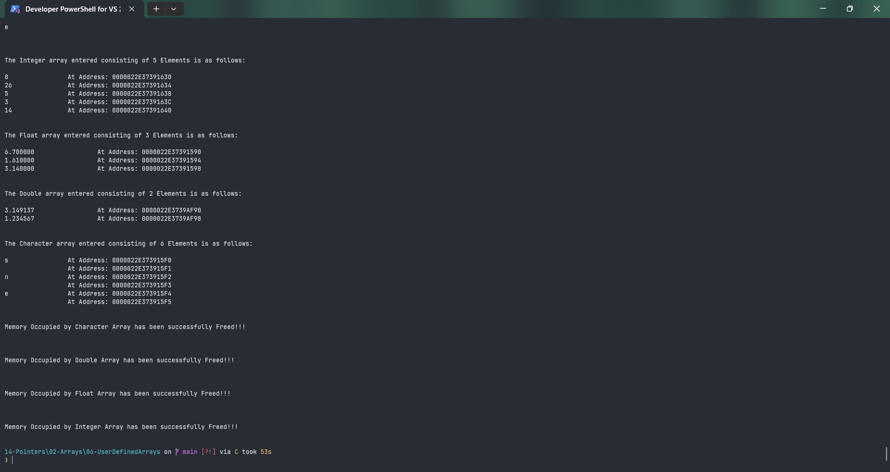
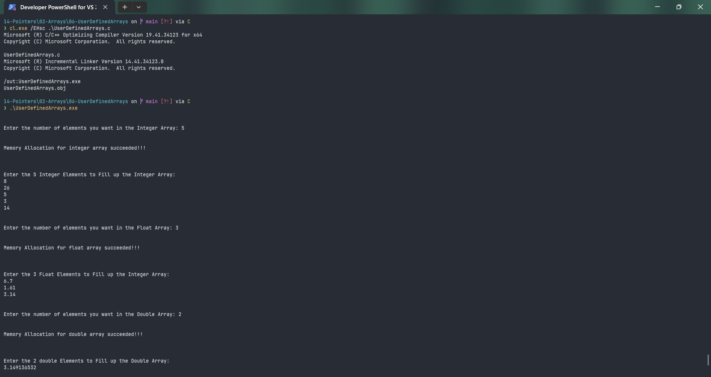

# UserDefinedArrays

Submitted by Yash Pravin Pawar (RTR2024-023)

## Output Screenshots




## Code
### [UserDefinedArrays.c](./01-Code/UserDefinedArrays.c)
```c
#include <stdio.h>
#include <stdlib.h>

#define INT_SIZE sizeof(int)
#define FLOAT_SIZE sizeof(float)
#define DOUBLE_SIZE sizeof(double)
#define CHAR_SIZE sizeof(char)

int main(void)
{
    // variable declarations
    int *ptr_ypp_iArray = NULL;
    unsigned int intYppArrayLength = 0;

    float *ptr_ypp_fArray = NULL;
    unsigned int floatYppArrayLength = 0;

    double *ptr_ypp_dArray = NULL;
    unsigned int doubleYppArrayLength = 0;

    char *ptr_ypp_cArray = NULL;
    unsigned int charYppArrayLength = 0;

    int i;

    // code
    // ########## INTEGER ARRAY ##########
    printf("\n\n");
    printf("Enter the number of elements you want in the Integer Array: ");
    scanf("%u", &intYppArrayLength);

    ptr_ypp_iArray = (int*) malloc(INT_SIZE * intYppArrayLength);

    if (ptr_ypp_iArray == NULL)
    {
        printf("\n\n");
        printf("Memory Allocation for integer array failed!!! exitting now...");
        exit(0);
    }
    else
    {
        printf("\n\n");
        printf("Memory Allocation for integer array succeeded!!!\n\n");
    }

    printf("\n\n");
    printf("Enter the %d Integer Elements to Fill up the Integer Array: \n", intYppArrayLength);

    for (i = 0; i < intYppArrayLength; i++) scanf("%d", (ptr_ypp_iArray + i));

    // ########## FLOAT ARRAY ##########
    printf("\n\n");
    printf("Enter the number of elements you want in the Float Array: ");
    scanf("%u", &floatYppArrayLength);

    ptr_ypp_fArray = (float*) malloc(INT_SIZE * floatYppArrayLength);

    if (ptr_ypp_fArray == NULL)
    {
        printf("\n\n");
        printf("Memory Allocation for Float array failed!!! exitting now...");
        exit(0);
    }
    else
    {
        printf("\n\n");
        printf("Memory Allocation for float array succeeded!!!\n\n");
    }

    printf("\n\n");
    printf("Enter the %d FLoat Elements to Fill up the Integer Array: \n", floatYppArrayLength);

    for (i = 0; i < floatYppArrayLength; i++) scanf("%f", (ptr_ypp_fArray + i));

    // ########## DOUBLE ARRAY ##########
    printf("\n\n");
    printf("Enter the number of elements you want in the Double Array: ");
    scanf("%u", &doubleYppArrayLength);

    ptr_ypp_dArray = (double*) malloc(INT_SIZE * doubleYppArrayLength);

    if (ptr_ypp_dArray == NULL)
    {
        printf("\n\n");
        printf("Memory Allocation for double array failed!!! exitting now...");
        exit(0);
    }
    else
    {
        printf("\n\n");
        printf("Memory Allocation for double array succeeded!!!\n\n");
    }

    printf("\n\n");
    printf("Enter the %d double Elements to Fill up the Double Array: \n", doubleYppArrayLength);

    for (i = 0; i < doubleYppArrayLength; i++) scanf("%lf", (ptr_ypp_dArray + i));

    // ########## CHAR ARRAY ##########
    printf("\n\n");
    printf("Enter the number of elements you want in the char Array: ");
    scanf("%u", &charYppArrayLength);

    ptr_ypp_cArray = (char*) malloc(INT_SIZE * charYppArrayLength);

    if (ptr_ypp_cArray == NULL)
    {
        printf("\n\n");
        printf("Memory Allocation for char array failed!!! exitting now...");
        exit(0);
    }
    else
    {
        printf("\n\n");
        printf("Memory Allocation for char array succeeded!!!\n\n");
    }

    printf("\n\n");
    printf("Enter the %d double Elements to Fill up the char Array: \n", charYppArrayLength);

    for (i = 0; i < charYppArrayLength; i++)
    {
        *(ptr_ypp_cArray + i) = getch();
        printf("%c\n", *(ptr_ypp_cArray + i));
    }

    // ########## Display Arrays ##########
    printf("\n\n");
    printf("The Integer array entered consisting of %d Elements is as follows: \n\n", intYppArrayLength);
    for (i = 0; i < intYppArrayLength; i++)
        printf("%d \t\t At Address: %p\n", *(ptr_ypp_iArray + i), (ptr_ypp_iArray + i));

    printf("\n\n");
    printf("The Float array entered consisting of %d Elements is as follows: \n\n", floatYppArrayLength);
    for (i = 0; i < floatYppArrayLength; i++)
        printf("%f \t\t At Address: %p\n", *(ptr_ypp_fArray + i), (ptr_ypp_fArray + i));

    printf("\n\n");
    printf("The Double array entered consisting of %d Elements is as follows: \n\n", doubleYppArrayLength);
    for (i = 0; i < doubleYppArrayLength; i++)
        printf("%lf \t\t At Address: %p\n", *(ptr_ypp_dArray + i), (ptr_ypp_dArray + i));

    printf("\n\n");
    printf("The Character array entered consisting of %d Elements is as follows: \n\n", charYppArrayLength);
    for (i = 0; i < charYppArrayLength; i++)
        printf("%c \t\t At Address: %p\n", *(ptr_ypp_cArray + i), (ptr_ypp_cArray + i));
    
    // ########## Freeing Memory ##########
    if (ptr_ypp_cArray)
    {
        free(ptr_ypp_cArray);
        ptr_ypp_cArray = NULL;

        printf("\n\n");
        printf("Memory Occupied by Character Array has been successfully Freed!!!\n\n");
    }
    
    if (ptr_ypp_dArray)
    {
        free(ptr_ypp_dArray);
        ptr_ypp_dArray = NULL;

        printf("\n\n");
        printf("Memory Occupied by Double Array has been successfully Freed!!!\n\n");
    }

    if (ptr_ypp_fArray)
    {
        free(ptr_ypp_fArray);
        ptr_ypp_fArray = NULL;

        printf("\n\n");
        printf("Memory Occupied by Float Array has been successfully Freed!!!\n\n");
    }

    if (ptr_ypp_iArray)
    {
        free(ptr_ypp_iArray);
        ptr_ypp_iArray = NULL;

        printf("\n\n");
        printf("Memory Occupied by Integer Array has been successfully Freed!!!\n\n");
    }

    return (0);
}

```
