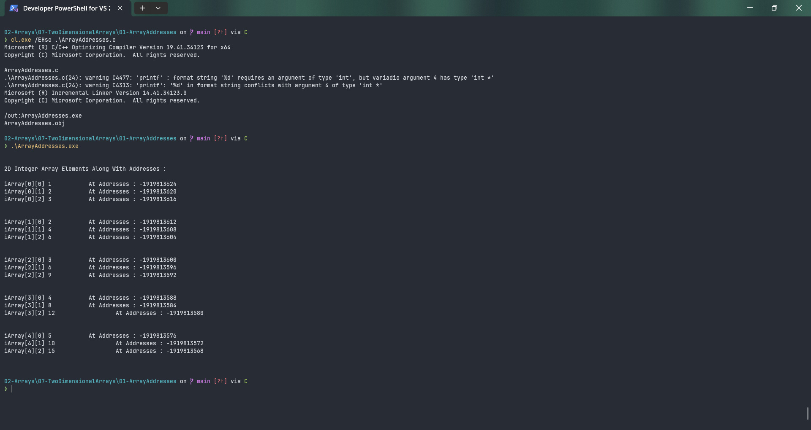

# ArrayAddresses

Submitted by Yash Pravin Pawar (RTR2024-023)

## Output Screenshots


## Code
### [ArrayAddresses.c](./01-Code/ArrayAddresses.c)
```c
#include <stdio.h>
#include <stdlib.h>

#define NUM_ROWS 5
#define NUM_COLUMNS 3

int main(void)
{
    int ypp_iArray[NUM_ROWS][NUM_COLUMNS];
    int i, j;

    for (i = 0; i < NUM_ROWS; i++)
    {
        for (j = 0; j < NUM_COLUMNS; j++)
            ypp_iArray[i][j] = (i + 1) * (j + 1);
    }

    printf("\n\n");
    printf("2D Integer Array Elements Along With Addresses : \n\n");
    for (i = 0; i < NUM_ROWS; i++)
    {
        for (j = 0; j < NUM_COLUMNS; j++)
        {
            printf("iArray[%d][%d] %d \t\t At Addresses : %d\n", i, j, ypp_iArray[i][j], &ypp_iArray[i][j]);
        }
        printf("\n\n");
    }

    return (0);
}

```
