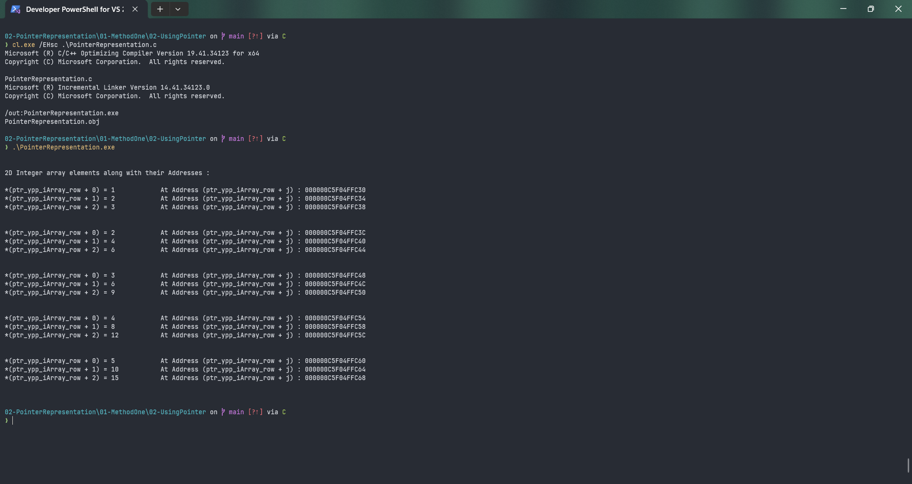

# PointerRepresentation

Submitted by Yash Pravin Pawar (RTR2024-023)

## Output Screenshots


## Code
### [PointerRepresentation.c](./01-Code/PointerRepresentation.c)
```c
#include <stdio.h>
#include <stdlib.h>

#define NUM_ROWS 5
#define NUM_COLUMS 3

int main(void)
{
    int ypp_iArray[NUM_ROWS][NUM_COLUMS];
    int i, j;

    int *ptr_ypp_iArray_row = NULL;

    for (i = 0; i < NUM_ROWS; i++)
    {
        ptr_ypp_iArray_row = ypp_iArray[i];        
        for (j = 0; j < NUM_COLUMS; j++)
        {
            *(ptr_ypp_iArray_row + j) = (i + 1) * (j + 1);
        }
    }

    printf("\n\n");
    printf("2D Integer array elements along with their Addresses : \n\n");

    for (i = 0; i < NUM_ROWS; i++)
    {
        ptr_ypp_iArray_row = ypp_iArray[i];
        for (j = 0; j < NUM_COLUMS; j++)
        {
            printf("*(ptr_ypp_iArray_row + %d) = %d\t\t At Address (ptr_ypp_iArray_row + j) : %p\n", j, *(ptr_ypp_iArray_row + j), (ptr_ypp_iArray_row + j));
        }

        printf("\n\n");
    }

    return (0);
}

```
