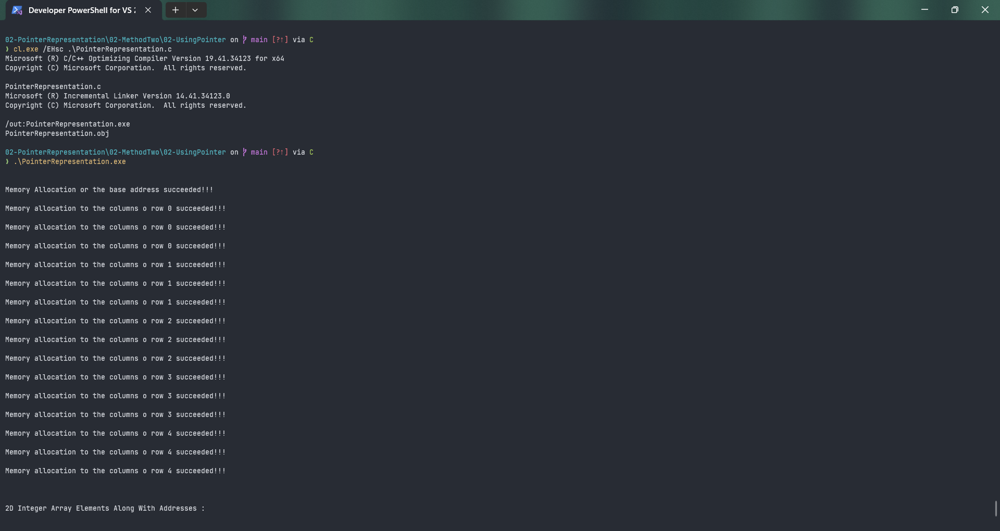

# PointerRepresentation

Submitted by Yash Pravin Pawar (RTR2024-023)

## Output Screenshots



## Code
### [PointerRepresentation.c](./01-Code/PointerRepresentation.c)
```c
#include <stdio.h>
#include <stdlib.h>

#define NUM_ROWS 5
#define NUM_COLUMNS 3

int main(void)
{
    int i, j;
    int **ptr_ypp_iArray = NULL;

    printf("\n\n");
    ptr_ypp_iArray = (int**) malloc(NUM_ROWS * sizeof(int*));

    if (ptr_ypp_iArray == NULL)
    {
        printf("Memory Allocation Falied!!! exiting now...\n\n");
        exit(0);
    }
    else 
        printf("Memory Allocation or the base address succeeded!!!\n\n");

    // Allocating each row
    for (i = 0; i < NUM_ROWS; i++)
    {
        for (j = 0; j < NUM_COLUMNS; j++)
        {
            ptr_ypp_iArray[i] = (int*) malloc(sizeof(int) * NUM_COLUMNS);
            if (ptr_ypp_iArray[i] == NULL)
            {
                printf("Memory allocation to the columns of row %d ailed!!! exiting now...\n\n", i);
                exit(0);
            }
            else
                printf("Memory allocation to the columns o row %d succeeded!!!\n\n", i);
        }
    }

    for (i = 0; i < NUM_ROWS; i++)
    {
        for (j = 0; j < NUM_COLUMNS; j++)
        {
            *(*(ptr_ypp_iArray + i) + j) = (i + 1) * (j + 1);
        }
    }

    // displaying values
    printf("\n\n");
    printf("2D Integer Array Elements Along With Addresses : \n\n");
    for (i = 0; i < NUM_ROWS; i++)
    {
        for (j = 0; j < NUM_COLUMNS; j++)
        {
            printf("ptr_iArrayRow[%d][%d] = %d\t\t At Address &ptr_iAddress[%d][%d] : %p\n", i, j, ptr_ypp_iArray[i][j], i, j, &ptr_ypp_iArray[i][j]);
        }
        printf("\n\n");
    }

    // freeing memory
    for (i = (NUM_ROWS - 1); i >= 0; i--)
    {
        if (*(ptr_ypp_iArray + i))
        {
            free(*(ptr_ypp_iArray + i));
            *(ptr_ypp_iArray + i)= NULL;
            printf("Memory allocated to row %d has been successfully freed!!! \n\n", i);
        }
    }

    if (ptr_ypp_iArray)
    {
        free(ptr_ypp_iArray);
        ptr_ypp_iArray = NULL;
        printf("Memory Allocated to ptr_ypp_iArray has been successfully freed!!!\n\n");
    }

    return (0);
}

```
