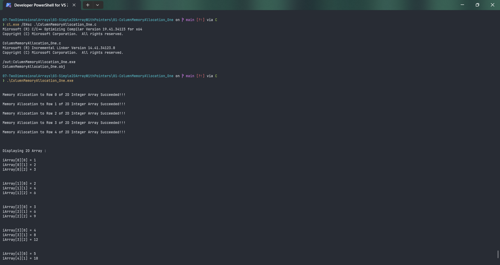
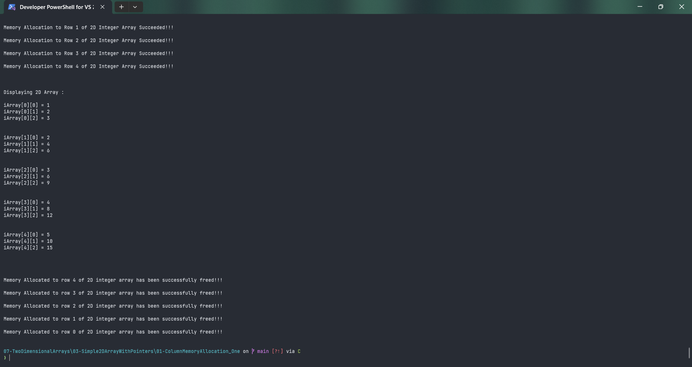

# ColumnMemoryAllocation_One

Submitted by Yash Pravin Pawar (RTR2024-023)

## Output Screenshots



## Code
### [ColumnMemoryAllocation_One.c](./01-Code/ColumnMemoryAllocation_One.c)
```c
#include <stdio.h>
#include <stdlib.h>

#define NUM_ROWS 5
#define NUM_COLUMNS 3

int main(void)
{
    int *ypp_iArray[NUM_ROWS];
    int i, j;

    printf("\n\n");
    for (i = 0; i < NUM_ROWS; i++)
    {
        ypp_iArray[i] = (int*) malloc(NUM_COLUMNS * sizeof(int));
        if (ypp_iArray == NULL)
        {
            printf("Falied to allocate memory to row %d of 2D Integer Array!!! Exitting now...\n\n", i);
            exit(0);
        }
        else 
            printf("Memory Allocation to Row %d of 2D Integer Array Succeeded!!!\n\n", i);
    }

    // assigning values
    for (i = 0; i < NUM_ROWS; i++)
    {
        for (j = 0; j < NUM_COLUMNS; j++)
        {
            ypp_iArray[i][j] = (i + 1) * (j + 1);
        }
    }

    // Display
    printf("\n\n");
    printf("Displaying 2D Array : \n\n");

    for (i = 0; i < NUM_ROWS; i++)
    {
        for (j = 0; j < NUM_COLUMNS; j++)
        {
            printf("iArray[%d][%d] = %d\n", i, j, ypp_iArray[i][j]);
        }
        printf("\n\n");
    }
    printf("\n\n");

    for (i = (NUM_ROWS - 1); i >= 0; i--)
    {
        free(ypp_iArray[i]);
        ypp_iArray[i] = NULL;
        printf("Memory Allocated to row %d of 2D integer array has been successfully freed!!! \n\n", i);
    }

    return (0);
}

```
