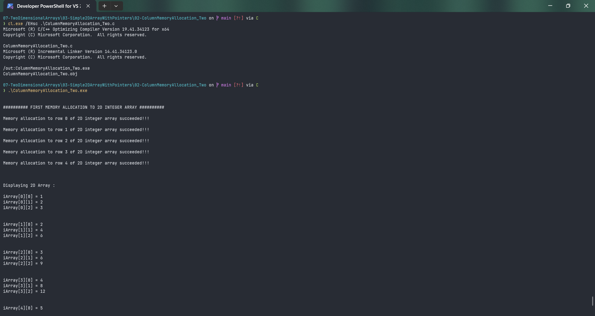
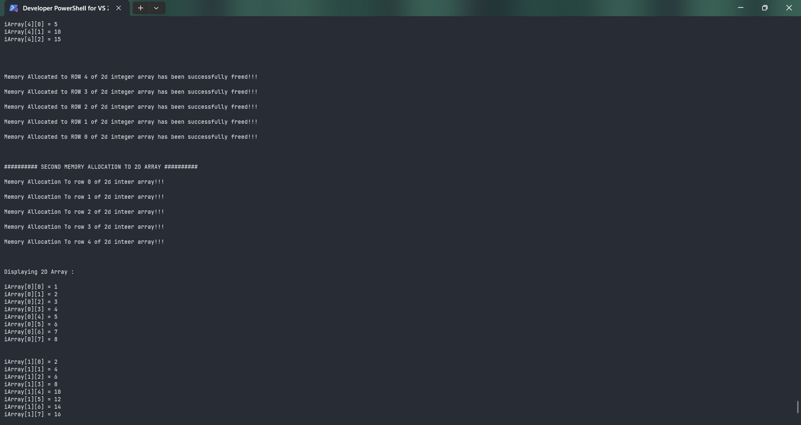
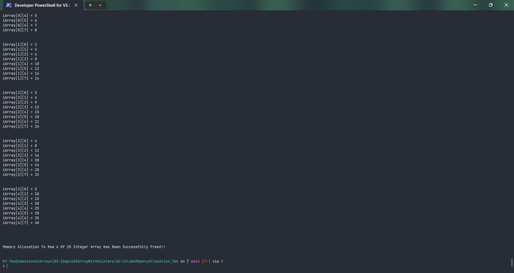

# ColumnMemoryAllocation_Two

Submitted by Yash Pravin Pawar (RTR2024-023)

## Output Screenshots




## Code
### [ColumnMemoryAllocation_Two.c](./01-Code/ColumnMemoryAllocation_Two.c)
```c
#include <stdio.h>
#include <stdlib.h>

#define NUM_ROWS 5
#define NUM_COLUMNS_ONE 3
#define NUM_COLUMNS_TWO 8

int main(void)
{
    int *ypp_iArray[NUM_ROWS];
    int i, j;

    printf("\n\n");
    printf("########## FIRST MEMORY ALLOCATION TO 2D INTEGER ARRAY ##########\n\n");

    for( i = 0; i < NUM_ROWS; i++ )
    {
        ypp_iArray[i] = (int*) malloc(NUM_COLUMNS_ONE * sizeof(int));

        if (ypp_iArray == NULL)
        {
            printf("FAILED TO ALLOCATE MEMORY TO ROW %d of 2D INTEGER ARRAY!!! Exiting now...\n\n", i);
            exit(0);
        }
        else
            printf("Memory allocation to row %d of 2D integer array succeeded!!! \n\n", i);
    }

    // assigning values to 2d array
    for (i = 0; i < NUM_ROWS; i++)
    {
        for (j = 0; j < NUM_COLUMNS_ONE; j++){
            ypp_iArray[i][j] = (i + 1) * (j + 1);
        }
    }

    printf("\n\n");
    printf("Displaying 2D Array : \n\n");
    for (i = 0; i < NUM_ROWS; i++)
    {
        for (j = 0; j < NUM_COLUMNS_ONE; j++)
        {
            printf("iArray[%d][%d] = %d\n", i, j, ypp_iArray[i][j]);
        }
        printf("\n\n");
    }
    printf("\n\n");

    for (i = (NUM_ROWS - 1); i >= 0; i--)
    {
        free(ypp_iArray[i]);
        ypp_iArray[i] = NULL;
        printf("Memory Allocated to ROW %d of 2d integer array has been successfully freed!!!\n\n", i);
    }

    // TWO AllocATING memory for an array of 8 integers per for
    printf("\n\n");
    printf("########## SECOND MEMORY ALLOCATION TO 2D ARRAY ##########\n\n");

    for (i = 0; i < NUM_ROWS; i++) 
    {
        ypp_iArray[i] = (int*) malloc(NUM_COLUMNS_TWO * sizeof(int));
        if (ypp_iArray[i] == NULL)
        {
            printf("Falied to Allocate memory to row %d of 2D integer array!!! exiting now...\n\n", i);
            exit(0);
        }
        else
            printf("Memory Allocation To row %d of 2d inteer array!!!\n\n", i);
    }

    for (i = 0; i < NUM_ROWS; i++)
    {
        for (j = 0; j < NUM_COLUMNS_TWO; j++)
        {
            ypp_iArray[i][j] = (i + 1) * (j + 1);
        }
    }

    printf("\n\n");
    printf("Displaying 2D Array : \n\n");

    for (i = 0; i < NUM_ROWS; i++)
    {
        for (j = 0; j < NUM_COLUMNS_TWO; j++)
        {
            printf("iArray[%d][%d] = %d\n", i, j, ypp_iArray[i][j]);
        }
        printf("\n\n");
    }
    printf("\n\n");

    for (i = (NUM_ROWS - 1); i >= 0; i--)
    {
        free(ypp_iArray[i]);
        ypp_iArray[i] = NULL;
        printf("Memory Allocation To Row %d Of 2D Integer Array Has Been Successfully Freed!! \n\n", i);

        return (0);
    }
}

```
