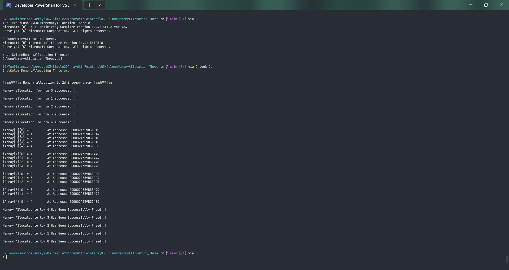

# ColumnMemoryAllocation_Three

Submitted by Yash Pravin Pawar (RTR2024-023)

## Output Screenshots


## Code
### [ColumnMemoryAllocation_Three.c](./01-Code/ColumnMemoryAllocation_Three.c)
```c
#include <stdio.h>
#include <stdlib.h>

#define NUM_ROWS 5
#define NUM_COLUMNS 5

int main(void)
{
    // variables
    int *ypp_iArray[NUM_ROWS];
    int i, j;

    printf("\n\n");
    printf("########## Memory allocation to 2d integer array ##########\n\n");

    for (i = 0; i < NUM_ROWS; i++)
    {
        ypp_iArray[i] = (int*) malloc((NUM_COLUMNS - i) * sizeof(int));

        if (ypp_iArray[i] == NULL)
        {
            printf("Falied to allocate memory to row %d of 2D array!!! exiting now...\n\n", i);
            exit(0);
        }
        else
            printf("Memory allocation for row %d succeeded !!!\n\n", i);
    }

    for (i = 0; i < NUM_ROWS; i++)
    {
        for (j = 0; j < (NUM_COLUMNS - i); j++)
        {
            ypp_iArray[i][j] = (i * 1) + (j * 1);
        }
    }

    for (i = 0; i < NUM_ROWS; i++)
    {   
        for (j = 0; j < (NUM_COLUMNS - i); j++)
        {
            printf("iArray[%d][%d] = %d \tAt Address: %p\n", i, j, ypp_iArray[i][j], &ypp_iArray[i][j]);
        }
        printf("\n");
    }

    for (i = (NUM_ROWS - 1); i >= 0; i--)
    {
        if (ypp_iArray[i])
        {
            free(ypp_iArray[i]);
            ypp_iArray[i] = NULL;
            printf("Memory Allocated to Row %d Has Been Successfully Freed!!!\n\n", i);
        }
    }

    return (0);
}

```
