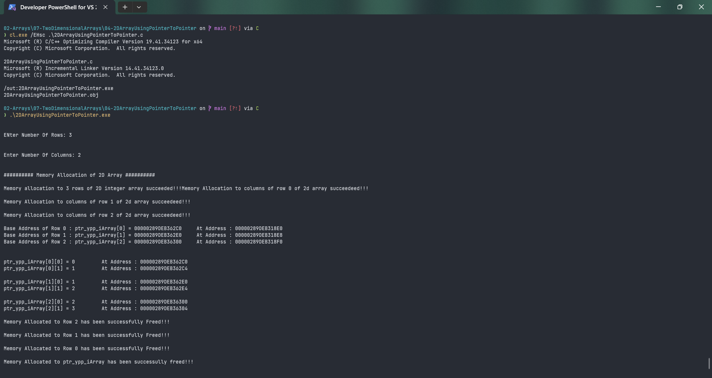

# 2DArrayUsingPointerToPointer

Submitted by Yash Pravin Pawar (RTR2024-023)

## Output Screenshots


## Code
### [2DArrayUsingPointerToPointer.c](./01-Code/2DArrayUsingPointerToPointer.c)
```c
#include <stdio.h>
#include <stdlib.h>

int main(void)
{
    int **ptr_ypp_iArray = NULL;
    int i, j;
    int num_rows, num_columns;

    printf("\n\n");
    printf("ENter Number Of Rows: ");
    scanf("%d", &num_rows);

    printf("\n\n");
    printf("Enter Number Of Columns: ");
    scanf("%d", &num_columns);

    printf("\n\n");
    printf("########## Memory Allocation of 2D Array ##########\n\n");
    ptr_ypp_iArray = (int**) malloc(num_rows * sizeof(int*));
    
    if (ptr_ypp_iArray == NULL)
    {
        printf("Failed to Allocate Memory to %d Rows of 2D array!!! Exitting now...\n\n", num_rows);
        exit(0);
    }
    else
        printf("Memory allocation to %d rows of 2D integer array succeeded!!!", num_rows);

    for (i = 0; i < num_rows; i++)
    {
        ptr_ypp_iArray[i] = (int*) malloc(num_columns * sizeof(int));

        if (ptr_ypp_iArray == NULL)
        {
            printf("Falied to allocate memory to columns of row %d of 2D integer array!!! exitting now...\n\n", i);
            exit(0);
        }
        else 
            printf("Memory Allocation to columns of row %d of 2d array succeedeed!!!\n\n", i);
    }

    for (i = 0; i < num_rows; i++)
    {
        for (j = 0; j < num_columns; j++)
            ptr_ypp_iArray[i][j] = (i * 1) + (j * 1);
    }

    // Displaying values
    for (i = 0; i < num_rows; i++)
    {
        printf("Base Address of Row %d : ptr_ypp_iArray[%d] = %p \t At Address : %p\n", i, i, ptr_ypp_iArray[i], &ptr_ypp_iArray[i]);
    }

    printf("\n\n");

    for (i = 0; i < num_rows; i++)
    {
        for (j = 0; j < num_columns; j++) 
        {
            printf("ptr_ypp_iArray[%d][%d] = %d \t At Address : %p\n", i, j, ptr_ypp_iArray[i][j], &ptr_ypp_iArray[i][j]);
        }
        printf("\n");
    }

    // freeing memory
    for (i = (num_rows - 1); i >= 0; i--)
    {
        if (ptr_ypp_iArray[i])
        {
            free(ptr_ypp_iArray[i]);
            ptr_ypp_iArray[i] = NULL;
            printf("Memory Allocated to Row %d has been successfully Freed!!! \n\n", i);
        }
    }

    if (ptr_ypp_iArray)
    {
        free(ptr_ypp_iArray);
        ptr_ypp_iArray = NULL;
        printf("Memory Allocated to ptr_ypp_iArray has been successully freed!!! \n\n");
    }

    return (0);
}

```
