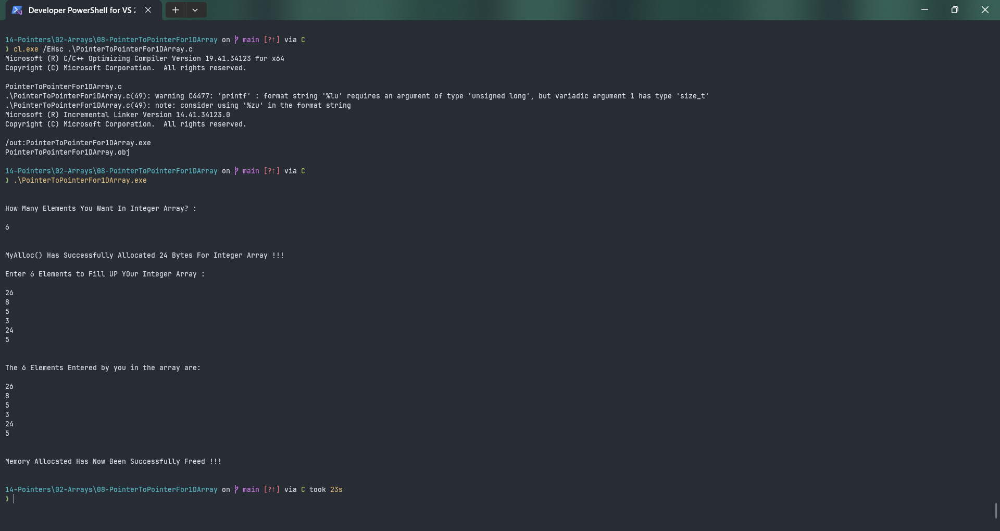

# PointerToPointerFor1DArray

Submitted by Yash Pravin Pawar (RTR2024-023)

## Output Screenshots


## Code
### [PointerToPointerFor1DArray.c](./01-Code/PointerToPointerFor1DArray.c)
```c
#include <stdio.h>
#include <stdlib.h>

int main(void)
{
    void MyAlloc(int **ptr, unsigned int numberOfElements);

    int *piArray = NULL;
    unsigned int ypp_num_elements;
    int i;

    // code
    printf("\n\n");
    printf("How Many Elements You Want In Integer Array? : \n\n");
    scanf("%u", &ypp_num_elements);

    printf("\n\n");
    MyAlloc(&piArray, ypp_num_elements);

    printf("Enter %u Elements to Fill UP YOur Integer Array : \n\n", ypp_num_elements);

    for (i = 0; i < ypp_num_elements; i++) scanf("%d", &piArray[i]);

    printf("\n\n");
    printf("The %u Elements Entered by you in the array are: \n\n", ypp_num_elements);
    for (i = 0; i < ypp_num_elements; i++)
        printf("%u\n", piArray[i]);

    printf("\n\n");
    if (piArray)
    {
        free(piArray);
        piArray = NULL;
        printf("Memory Allocated Has Now Been Successfully Freed !!!\n\n");
    }

    return (0);
}

void MyAlloc(int **ptr, unsigned int numberOfElements)
{
    *ptr = (int*) malloc(numberOfElements * sizeof(int));
    if (*ptr == NULL)
    {
        printf("Could NOt Allocate Memory !!! Exiting now... \n\n");
        exit(0);
    }

    printf("MyAlloc() Has Successfully Allocated %lu Bytes For Integer Array !!!\n\n", (numberOfElements * sizeof(int)));
}

```
