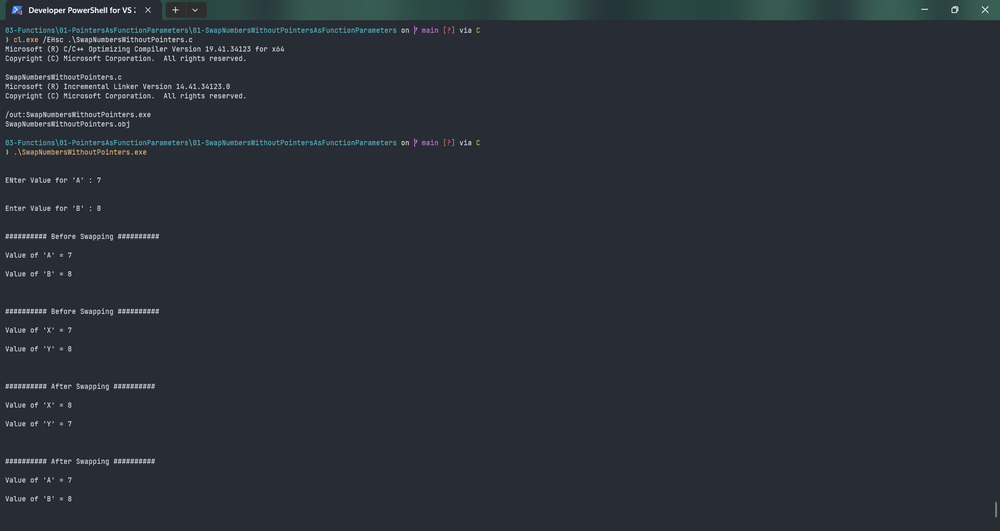

# SwapNumbersWithoutPointers

Submitted by Yash Pravin Pawar (RTR2024-023)

## Output Screenshots


## Code
### [SwapNumbersWithoutPointers.c](./01-Code/SwapNumbersWithoutPointers.c)
```c
#include <stdio.h>

int main(void)
{
    // function declarations
    void SwapNumbers(int, int);

    // variable declarations
    int ypp_a, ypp_b;

    // Code
    printf("\n\n");
    printf("ENter Value for 'A' : ");
    scanf("%d", &ypp_a);
    
    printf("\n\n");
    printf("Enter Value for 'B' : ");
    scanf("%d", &ypp_b);
    
    printf("\n\n");
    printf("########## Before Swapping ##########\n\n");
    printf("Value of 'A' = %d\n\n", ypp_a);
    printf("Value of 'B' = %d\n\n", ypp_b);

    SwapNumbers(ypp_a, ypp_b);

    printf("\n\n");
    printf("########## After Swapping ##########\n\n");
    printf("Value of 'A' = %d\n\n", ypp_a);
    printf("Value of 'B' = %d\n\n", ypp_b);

    return (0);
}

void SwapNumbers(int x, int y)
{
    // variable declarations
    int temp;

    // code
    printf("\n\n");
    printf("########## Before Swapping ##########\n\n");
    printf("Value of 'X' = %d\n\n", x);
    printf("Value of 'Y' = %d\n\n", y);

    temp = x;
    x = y;
    y = temp;

    printf("\n\n");
    printf("########## After Swapping ##########\n\n");
    printf("Value of 'X' = %d\n\n", x);
    printf("Value of 'Y' = %d\n\n", y);
}

```
