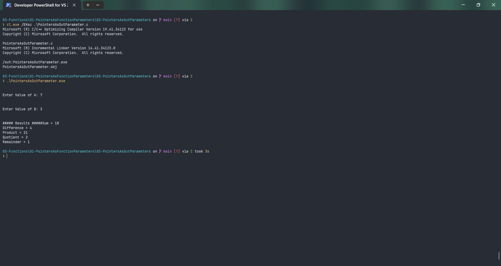

# PointersAsOutParameter

Submitted by Yash Pravin Pawar (RTR2024-023)

## Output Screenshots


## Code
### [PointersAsOutParameter.c](./01-Code/PointersAsOutParameter.c)
```c
#include <stdio.h>

int main(void)
{
    // function declarations
    void MathematicalOperations(int, int, int*, int*, int*, int*, int*);

    // variable declarations
    int ypp_a, ypp_b;
    int ypp_answer_sum;
    int ypp_answer_difference;
    int ypp_answer_product;
    int ypp_answer_quotient;
    int ypp_answer_remainder;

    // code
    printf("\n\n");
    printf("Enter Value of A: ");
    scanf("%d", &ypp_a);

    printf("\n\n");
    printf("Enter Value of B: ");
    scanf("%d", &ypp_b);

    MathematicalOperations(ypp_a, ypp_b, &ypp_answer_sum, &ypp_answer_difference, &ypp_answer_product, &ypp_answer_quotient, &ypp_answer_remainder);

    printf("\n\n");
    printf("##### Results #####");
    printf("Sum = %d\n", ypp_answer_sum);
    printf("Difference = %d\n", ypp_answer_difference);
    printf("Product = %d\n", ypp_answer_product);
    printf("Quotient = %d\n", ypp_answer_quotient);
    printf("Remainder = %d\n", ypp_answer_remainder);

    return (0);
}

void MathematicalOperations(int x, int y, int* sum, int* diff, int* product, int* quotient, int* remainder)
{
    // code
    *sum = x + y;
    *diff = x - y;
    *product = x * y;
    *quotient = x / y;
    *remainder = x % y;
}

```
