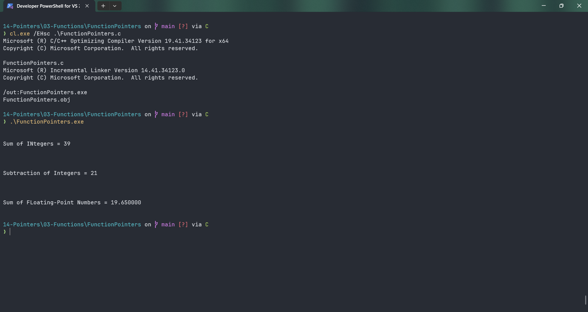

# FunctionPointers

Submitted by Yash Pravin Pawar (RTR2024-023)

## Output Screenshots


## Code
### [FunctionPointers.c](./01-Code/FunctionPointers.c)
```c
#include <stdio.h>

int main(void)
{
    // function declarations
    int AddIntegers(int, int);
    int SubtractIntegers(int, int);
    float AddFloats(float, float);

    // variable declaration
    typedef int (*AddIntsFnPtr)(int, int);
    AddIntsFnPtr ptrYppAddTwoIntegers = NULL;
    AddIntsFnPtr ptrYppFunc = NULL;

    typedef float (*AddFloatsFnPtr)(float, float);
    AddFloatsFnPtr ptrYppAddTwoFloats = NULL;

    int iYppAnswer = 0;
    float fYppAnswer = 0.0f;

    // code
    ptrYppAddTwoIntegers = AddIntegers;

    iYppAnswer = ptrYppAddTwoIntegers(9, 30);
    printf("\n\n");
    printf("Sum of INtegers = %d\n\n", iYppAnswer);

    ptrYppFunc = SubtractIntegers;
    iYppAnswer = ptrYppFunc(9, 30);
    printf("\n\n");
    printf("Subtraction of Integers = %d\n\n", iYppAnswer);

    ptrYppAddTwoFloats = AddFloats;
    fYppAnswer = ptrYppAddTwoFloats(11.45f, 8.2f);
    printf("\n\n");
    printf("Sum of FLoating-Point Numbers = %f\n\n", fYppAnswer);

    return (0);
}

int AddIntegers(int a, int b)
{
    int c;
    c = a + b;
    return c;
}

int SubtractIntegers(int a, int b)
{
    int c;

    if (a > b)
        c = a - b;
    else
        c = b - a;

    return c;
}

float AddFloats(float fa, float fb)
{
    float c;
    c = fa + fb;
    return c;
}

```
