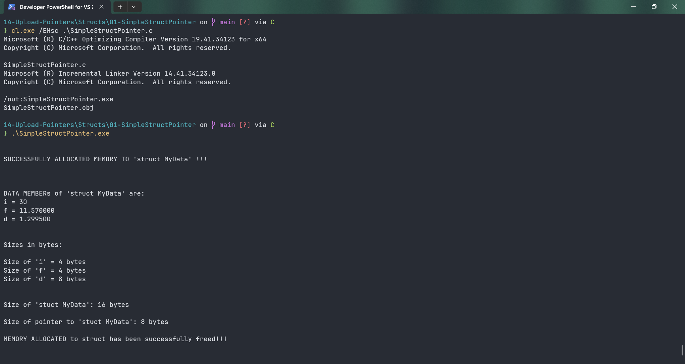

# SimpleStructPointer

Submitted by Yash Pravin Pawar (RTR2024-023)

## Output Screenshots


## Code
### [SimpleStructPointer.c](./01-Code/SimpleStructPointer.c)
```c
#include <stdio.h>
#include <stdlib.h>

// Defining struct
struct MyData 
{
    int i;
    float f;
    double d;
};

int main(void) 
{
    // variable declarations
    int ypp_i_size;
    int ypp_f_size;
    int ypp_d_size;
    int ypp_struct_MyData_size;
    int ypp_pointer_to_struct_MyData_size;

    struct MyData *p_ypp_data = NULL;

    // code
    printf("\n\n");

    p_ypp_data = (struct MyData*) malloc(sizeof(struct MyData));


    if (p_ypp_data == NULL) 
    {
        printf("FAILED TO ALLOCATE MEMORY TO 'stuct MyData' !!! EXITING NOW...\n\n");
        exit(0);
    }
    else    
        printf("SUCCESSFULLY ALLOCATED MEMORY TO 'struct MyData' !!! \n\n");

    // assigining data values ot the data members of struct
    p_ypp_data->i = 30;
    p_ypp_data->f = 11.57f;
    p_ypp_data->d = 1.2995;

    // Displaying the values of the data members of struct
    printf("\n\n");
    printf("DATA MEMBERs of 'struct MyData' are: \n");
    printf("i = %d\n", p_ypp_data->i);
    printf("f = %f\n", p_ypp_data->f);
    printf("d = %lf\n", p_ypp_data->d);

    // calculatinf the sizes in bytes
    ypp_i_size = sizeof(p_ypp_data->i);
    ypp_f_size = sizeof(p_ypp_data->f);
    ypp_d_size = sizeof(p_ypp_data->d);

    printf("\n\n");
    printf("Sizes in bytes: \n\n");
    printf("Size of 'i' = %d bytes\n", ypp_i_size);
    printf("Size of 'f' = %d bytes\n", ypp_f_size);
    printf("Size of 'd' = %d bytes\n", ypp_d_size);

    // Clculating the size in bytes of the entire struct;
    ypp_struct_MyData_size = sizeof(struct MyData);
    ypp_pointer_to_struct_MyData_size = sizeof(struct MyData*);

    // Displaying sizes in bytes of the entire struct
    printf("\n\n");
    printf("Size of 'stuct MyData': %d bytes\n\n", ypp_struct_MyData_size);
    printf("Size of pointer to 'stuct MyData': %d bytes\n\n", ypp_pointer_to_struct_MyData_size);

    if (p_ypp_data)
    {
        free(p_ypp_data);
        p_ypp_data = NULL;
        printf("MEMORY ALLOCATED to struct has been successfully freed!!!\n\n");
    }

    return (0);
}

```
