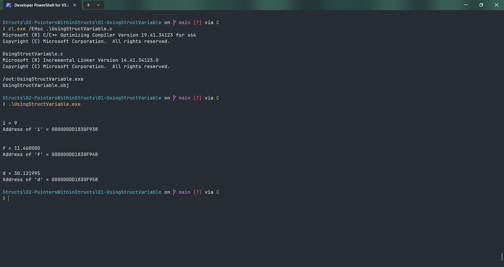

# UsingStructVariable

Submitted by Yash Pravin Pawar (RTR2024-023)

## Output Screenshots


## Code
### [UsingStructVariable.c](./01-Code/UsingStructVariable.c)
```c
#include <stdio.h>

// Defining Struct
struct MyData
{
    int *ptr_i;
    int i;

    float *ptr_f;
    float f;

    double *ptr_d;
    double d;
};

int main(void)
{
    // Variable declarations
    struct MyData ypp_data;

    // code
    ypp_data.i = 9;
    ypp_data.ptr_i = &ypp_data.i;
    
    ypp_data.f = 11.46f;
    ypp_data.ptr_f = &ypp_data.f;
    
    ypp_data.d = 30.121995;
    ypp_data.ptr_d = &ypp_data.d;

    printf("\n\n");
    printf("i = %d\n", *(ypp_data.ptr_i));
    printf("Address of 'i' = %p\n", ypp_data.ptr_i);

    
    printf("\n\n");
    printf("f = %f\n", *(ypp_data.ptr_f));
    printf("Address of 'f' = %p\n", ypp_data.ptr_f);

    printf("\n\n");
    printf("d = %lf\n", *(ypp_data.ptr_d));
    printf("Address of 'd' = %p\n", ypp_data.ptr_d);

    return (0);
}

```
