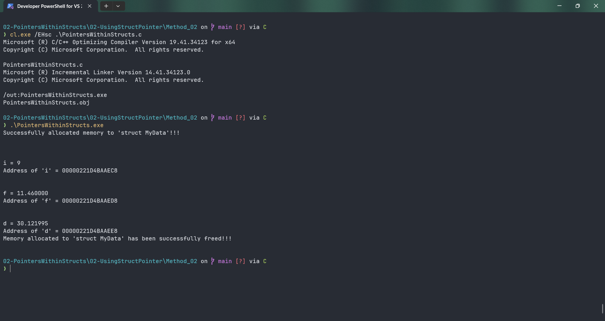

# PointersWithinStructs

Submitted by Yash Pravin Pawar (RTR2024-023)

## Output Screenshots


## Code
### [PointersWithinStructs.c](./01-Code/PointersWithinStructs.c)
```c
#include <stdio.h>
#include <stdlib.h>

// Defining Struct
struct MyData
{
    int *ptr_i;
    int i;

    float *ptr_f;
    float f;

    double *ptr_d;
    double d;
};

int main(void)
{
    // Variable declarations
    struct MyData *p_ypp_data;

    p_ypp_data = (struct MyData *)malloc(sizeof(struct MyData));
    if (p_ypp_data == NULL)
    {
        printf("Failed to allocate memory to the 'struct MyData' !!! Exitting Now...\n");
        exit(0);
    }
    else
        printf("Successfully allocated memory to 'struct MyData'!!!\n\n");

    // code
    p_ypp_data->i = 9;
    p_ypp_data->ptr_i = &p_ypp_data->i;

    p_ypp_data->f = 11.46f;
    p_ypp_data->ptr_f = &p_ypp_data->f;

    p_ypp_data->d = 30.121995;
    p_ypp_data->ptr_d = &p_ypp_data->d;

    printf("\n\n");
    printf("i = %d\n", *(p_ypp_data->ptr_i));
    printf("Address of 'i' = %p\n", p_ypp_data->ptr_i);

    printf("\n\n");
    printf("f = %f\n", *(p_ypp_data->ptr_f));
    printf("Address of 'f' = %p\n", p_ypp_data->ptr_f);

    printf("\n\n");
    printf("d = %lf\n", *(p_ypp_data->ptr_d));
    printf("Address of 'd' = %p\n", p_ypp_data->ptr_d);

    if (p_ypp_data)
    {
        free(p_ypp_data);
        p_ypp_data = NULL;
        printf("Memory allocated to 'struct MyData' has been successfully freed!!! \n\n");
    }

    return (0);
}

```
