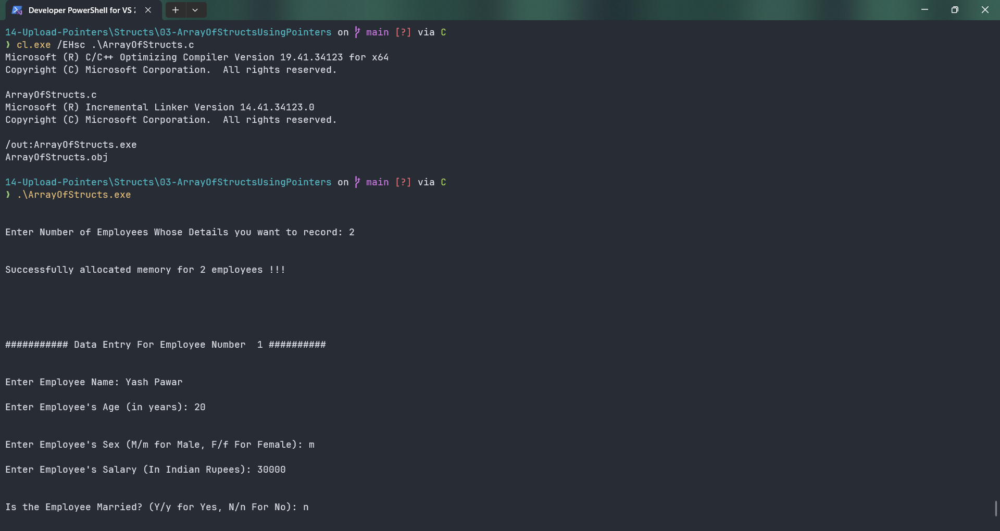

# ArrayOfStructs

Submitted by Yash Pravin Pawar (RTR2024-023)

## Output Screenshots



## Code
### [ArrayOfStructs.c](./01-Code/ArrayOfStructs.c)
```c
#include <stdio.h>
#include <ctype.h>
#include <stdlib.h>

#define NAME_LENGTH 100
#define MARITAL_STATUS 10

struct Employee
{
    char name[NAME_LENGTH];
    int age;
    char sex;
    float salary;
    char marital_status;
};

int main(void) 
{
    // function prototype
    void MyGetString(char[], int);

    // variable declarations
    struct Employee *pYppEmployeeRecord = NULL;
    int ypp_num_employees, ypp_i;

    // code
    printf("\n\n");
    printf("Enter Number of Employees Whose Details you want to record: ");
    scanf("%d", &ypp_num_employees);

    printf("\n\n");
    pYppEmployeeRecord = (struct Employee*) malloc(sizeof(struct Employee) * ypp_num_employees);

    if (pYppEmployeeRecord == NULL)
    {
        printf("Failed to allocate memory for %d employees !! exitting now...\n\n", ypp_num_employees);
    }
    else
        printf("Successfully allocated memory for %d employees !!!\n\n", ypp_num_employees);

    // USER input initialization
    for (ypp_i = 0; ypp_i < ypp_num_employees; ypp_i++)
    {
        printf("\n\n\n\n");
        printf("########### Data Entry For Employee Number %2d ##########\n", ypp_i + 1);

        printf("\n\n");
        printf("Enter Employee Name: ");
        MyGetString(pYppEmployeeRecord[ypp_i].name, NAME_LENGTH);

        printf("\n\n");
        printf("Enter Employee's Age (in years): ");
        scanf("%d", &pYppEmployeeRecord[ypp_i].age);

        printf("\n\n");
        printf("Enter Employee's Sex (M/m for Male, F/f For Female): ");
        pYppEmployeeRecord[ypp_i].sex = getch();
        printf("%c", pYppEmployeeRecord[ypp_i].sex);

        
        printf("\n\n");
        printf("Enter Employee's Salary (In Indian Rupees): ");
        scanf("%f", &pYppEmployeeRecord[ypp_i].salary);

        printf("\n\n");
        printf("Is the Employee Married? (Y/y for Yes, N/n For No): ");
        pYppEmployeeRecord[ypp_i].marital_status = getch();
        printf("%c", pYppEmployeeRecord[ypp_i].marital_status);
    }

    // ##### Display #####
    printf("\n\n\n\n");
    printf("########## Displaying Employee Records ##########\n\n");

    for (ypp_i = 0; ypp_i < ypp_num_employees; ypp_i++) 
    {
        printf("########## Employee Number %d ##########\n\n", (ypp_i + 1));
        printf("Name \t: %s\n", pYppEmployeeRecord[ypp_i].name);
        printf("Age \t: %d\n", pYppEmployeeRecord[ypp_i].age);
    
        switch (pYppEmployeeRecord[ypp_i].sex)
        {
            case 'M':
            case 'm':
                printf("Sex \t: Male\n");
                break;
            case 'F':
            case 'f':
                printf("Sex \t: Female\n");
                break;
            default: 
                printf("Sex \t: Invalid Data Entered\n");
        }

        printf("Salary \t: Rs. %f\n", pYppEmployeeRecord[ypp_i].salary);

        switch (pYppEmployeeRecord[ypp_i].marital_status)
        {
            case 'Y':
            case 'y':
                printf("Maritial Status \t: Married\n");
                break;
            case 'N':
            case 'n':
                printf("Maritial Status \t: Unmarried\n");
                break;
            default: 
                printf("Maritial Status \t: Invalid Data Entered\n");
        }

        printf("\n\n");
    }

    if (pYppEmployeeRecord)
    {
        free(pYppEmployeeRecord);
        pYppEmployeeRecord = NULL;
        printf("Memory Allocated to %d Employees has been sucessfully freed !!! \n\n", ypp_num_employees);
    }

    return (0);
}

// Simple implemented to get_s()
void MyGetString(char str[], int str_size)
{
    // variable declarations
    int i;
    char ch = '\0';

    // code
    i = 0;
    do 
    {
        ch = getch();
        str[i] = ch;
        printf("%c", str[i]);
        i++;
    } while ((ch != '\r') && (i < str_size));

    if (i == str_size)
        str[i - 1] = '\0';
    else
        str[i] = '\0';
}

```
