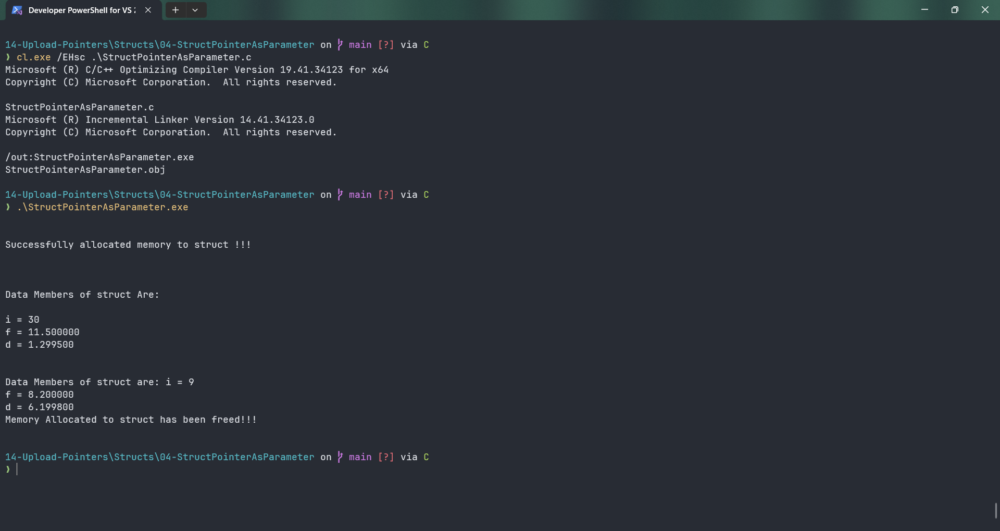

# StructPointerAsParameter

Submitted by Yash Pravin Pawar (RTR2024-023)

## Output Screenshots


## Code
### [StructPointerAsParameter.c](./01-Code/StructPointerAsParameter.c)
```c
#include <stdio.h>
#include <stdlib.h>

// Defining struct
struct MyData
{
    int i;
    float f;
    double d;
};

int main(void)
{
    // function prototypes
    void ChangeValues(struct MyData*);

    // Variable declarations
    struct MyData *pYppData = NULL;

    // code
    printf("\n\n");

    pYppData = (struct MyData*) malloc(sizeof(struct MyData));

    if (pYppData == NULL)
    {
        printf("Falied to allocate memory!!! exitting now... \n\n");
        exit(0);
    }
    else
        printf("Successfully allocated memory to struct !!!\n\n");

    // Assigning data values to the data memmbers of struct
    pYppData->i = 30;
    pYppData->f = 11.50f;
    pYppData->d = 1.2995;

    // displaying values of the data members
    printf("\n\n");
    printf("Data Members of struct Are: \n\n");
    printf("i = %d\n", pYppData->i);
    printf("f = %f\n", pYppData->f);
    printf("d = %lf\n", pYppData->d);

    ChangeValues(pYppData);

    // displaying values of the data members of struct
    printf("\n\n");
    printf("Data Members of struct are: ");
    printf("i = %d\n", pYppData->i);
    printf("f = %f\n", pYppData->f);
    printf("d = %lf\n", pYppData->d);

    if (pYppData)
    {
        free(pYppData);
        pYppData = NULL;
        printf("Memory Allocated to struct has been freed!!!\n\n");
    }

    return (0);
}

void ChangeValues(struct MyData* pParam_Data) 
{
    pParam_Data->i = 9;
    pParam_Data->f = 8.2f;
    pParam_Data->d = 6.1998;
}

```
